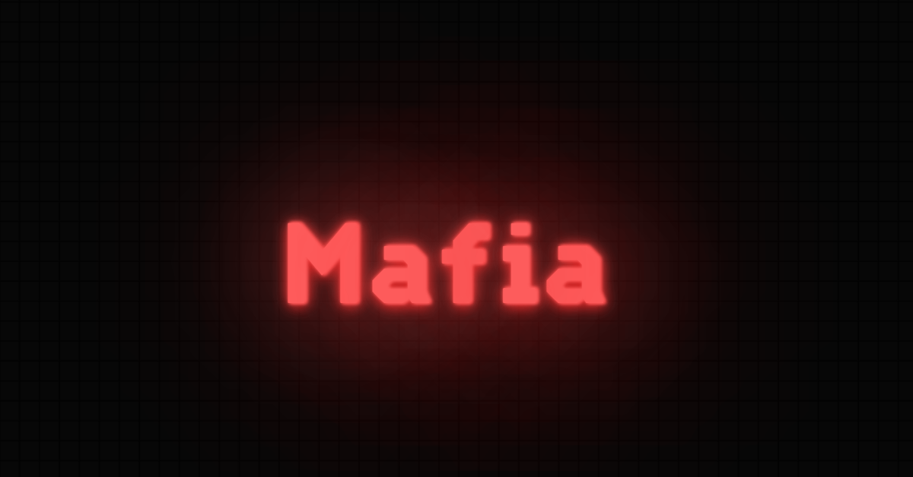

# NachoToast / Mafia <!-- omit in toc -->

## Table of Contents <!-- omit in toc -->

- [Technologies](#technologies)
- [Contributing](#contributing)
- [Installation Guide](#installation-guide)
- [License](#license)

## Technologies

## Contributing

See [contributing](.github/CONTRIBUTING.md).

## Installation Guide

See [installation guide](.github/INSTALL_GUIDE.md).

## License

This code is licensed under the [MIT License](LICENSE).
